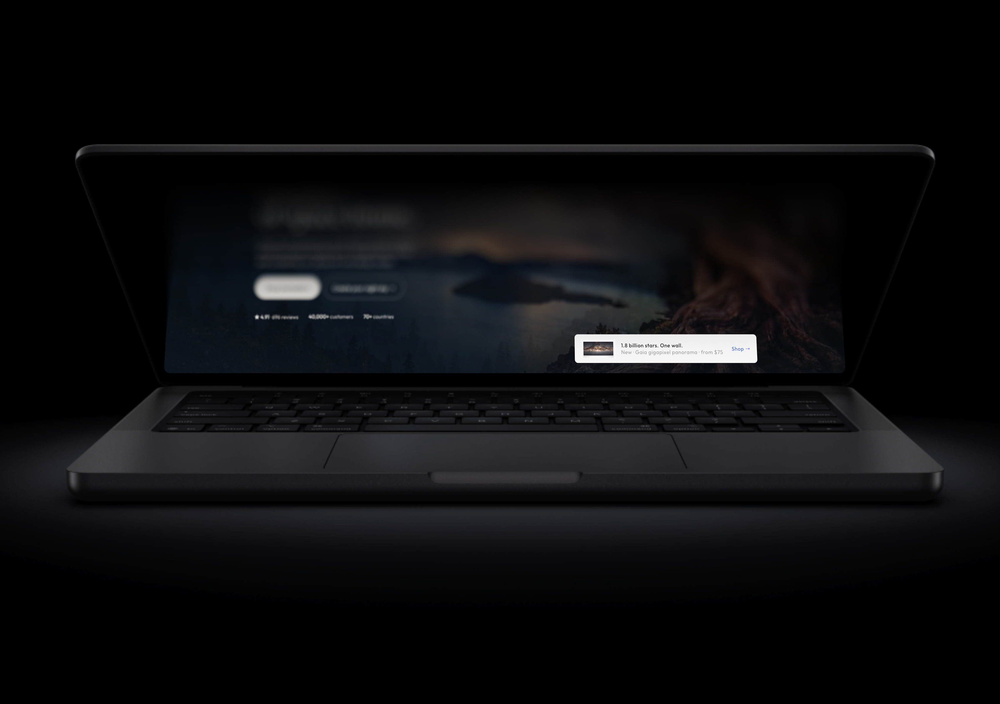
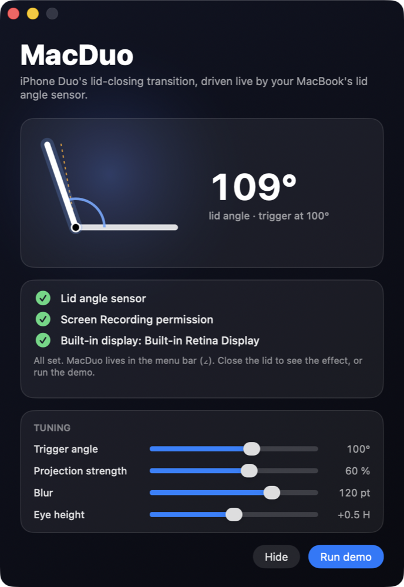

# MacDuo



The iPhone Duo "lid closing" transition, recreated on a MacBook.

When you close the lid, the display captures itself — live, not a screenshot — and re-projects
the picture so that it appears to **stay where the screen was** while the physical lid rotates
through it. The
far edge blurs progressively and fades to black; the hinge edge stays sharp. Open the lid and the
effect unfolds back into the live desktop.

Everything is driven live by the MacBook's hidden lid angle sensor. No animation timing — the
effect follows your hand.

## What the iPhone Duo does

The Duo does not cut between its outer and inner displays. The UI on the folding half is
projected "front-view" and stays pinned to the hinge edge, so during the fold it looks as if the
content stayed put in space while the glass moved through it. On top of that: progressive blur
(growing with distance from the hinge), darkening at roughly twice the transition strength, and
soft gradients — all driven in real time by the hinge sensors.

## It's not a rotation — it's a homography

A naive version rotates the screenshot in 3D. That looks wrong: the perspective narrows too much
and nothing "stays in place". The correct picture is a **central projection from the viewer's
eye between two planes that share an axis (the hinge)**:

- plane P0: the lid at the trigger angle θ0 — where the virtual screen "stays",
- plane P1: the lid at the current angle θ0 − δ — the physical panel we draw on,
- eye E: in front of P0's center at distance D, raised by e along the screen.

For every point on the physical panel, the ray from the eye through it hits P0 somewhere; that is
the pixel to show. In plane-local coordinates (x from the center, y from the hinge) this is a
planar homography:

```
x1 = K·x0 / (K − b·y0)        y1 = c·y0 / (K − b·y0)

b = sin δ      c = −D      K = b·(H/2 + e) − D·cos δ
```

δ = 0 gives the identity; the hinge (y0 = 0) always maps to the hinge. The matrix goes straight
into a `CATransform3D` (`m11 = −K, m22 = −c, m24 = b, m44 = −K`, negated so the homogeneous `w`
stays positive), so Core Animation renders it exactly, with no extra camera. Beyond δ ≈ 58° the
rays to the lowest rows become parallel to the lid (denominator → 0), so δ is clamped there; by
then the image is blurred and black anyway.

Verified on rendered frames: the width of the top screen row is 77% at δ = 40° (formula: 75–77%)
and 69% at δ = 58° (formula: 67–69%).

The stretch you see is not an arbitrary factor either — it falls out of the eye position. Raise
the eye (`--eye-height`) and the far edge stretches more; move it closer (`--eye-distance`) and
the perspective gets stronger.

The exact geometry can feel too eager (the far edge shoots up quickly), so a **projection
strength** knob scales δ before it enters the homography: 100% is the exact geometry, the
default 60% is gentler. It is a slider in the status window and `--strength` on the command
line.

## The lid angle sensor

Apple Silicon MacBooks (and the 2019 16" MBP) expose a lid angle sensor as a HID device:

| Parameter | Value |
|---|---|
| Vendor / Product | 0x05AC / 0x8104 |
| Usage page / usage | 0x0020 (Sensor) / 0x008A (Orientation) |
| Read | feature report ID 1, 3 bytes |
| Angle | `UInt16(buf[2]) << 8 \| buf[1]`, in whole degrees |
| Range | ~0° closed, ~130° fully open |

No entitlement or permission is needed. It is an undocumented interface and may change with an OS
update. One gotcha: the `IOHIDManager` must be kept alive as long as the device — release it and
`IOHIDDeviceGetReport` returns `kIOReturnNotOpen` (0xe00002cd).

## Pipeline

1. **Poll** the sensor at 120 Hz.
2. **Arm** the live capture when the lid starts closing within 12° of the threshold: an
   `SCStream` of the built-in display starts (200–300 ms), with the app's own windows excluded
   from the filter so the overlay never captures itself. It is dropped again if the lid moves
   away or sits still for 15 s.
3. **Trigger** when the raw angle crosses `startAngle` (100°) downward. If the stream is already
   delivering, the effect starts on the same frame (measured: 0 ms); otherwise it waits for the
   first frame. Every captured frame arrives as an IOSurface-backed pixel buffer and goes straight
   into the plane's layer contents — the folded image is the real, live screen: cursor,
   animations, video. `--still` switches back to a single screenshot.
4. **Smooth.** The sensor gives whole degrees, so the raw angle goes through a critically damped
   spring filter (`smoothHz`, 4.5 Hz). Steps disappear; during continuous motion the filter keeps
   the velocity, so the lag is small (~70 ms) and constant. Rendering runs on the built-in
   display's `CADisplayLink` (120 Hz on ProMotion).
5. **Project.** Every frame, compute the homography for δ = θ0 − θ and set it as the plane's
   transform.
6. **Blur & fade.** `progress = (startAngle − θ) / (startAngle − fullAngle)` drives five
   `CIGaussianBlur` layers with growing radii (up to 120 pt), each with a gradient mask — sharp at
   the hinge, strongest at the far edge. The blurred layers sit on a transparent margin so the
   halo bleeds past the panel outline. A gradient fades the far edge (and the halo above it) to
   full black.
7. **Release.** When the lid opens above `startAngle + 6°`, progress returns to 0 (the "unfold")
   and the overlay hides. The log prints fps statistics.

Only the **built-in display** is ever captured or covered (`CGDisplayIsBuiltin`); external
screens are untouched. The startup log lists every display and which one is used.

## Download

Prebuilt DMGs, signed with a Developer ID and notarized by Apple, are on the
[Releases page](https://github.com/ashtree74/MacDuo/releases). Open the DMG and drag MacDuo to
Applications; it launches without Gatekeeper warnings.

## Build & run

```sh
./build.sh              # builds build/MacDuo.app with swiftc — no Xcode project
open build/MacDuo.app   # lives in the menu bar (∠), no Dock icon
NOTARY_PROFILE=<notarytool keychain profile> ./release.sh 0.1.0   # signed + notarized DMG, GitHub release
```

Requires macOS 14+ and an Apple Silicon MacBook (for the sensor; the demo works anywhere).

On launch a status window shows a live gauge of the lid angle (side profile of the laptop with
the trigger angle marked), the three checks the effect needs, and tuning sliders:



- lid angle sensor found,
- **Screen Recording** permission (System Settings → Privacy & Security → Screen Recording;
  without it the wallpaper is used instead of the real screen). MacDuo requests it at launch and
  relaunches itself once it is granted; a "Grant access…" button opens the right pane.
- built-in display present.

Sliders: **Trigger angle** (60–125°), **Projection strength** (0–100%), **Blur** (0–160 pt),
**Eye height** (−0.5…+1.5 H). Values are saved in UserDefaults (`pl.jesion.macduo`) and
restored on the next launch; command-line flags override them.

`build.sh` signs the app with a Developer ID / Apple Development certificate from your keychain
if one exists (locally, no notarization). This matters: an ad-hoc signature's designated
requirement is the `cdhash`, which changes on every build, and macOS would ask for the permission
again after each rebuild.

Menu bar items: **Status & permissions**, **Demo** (scripted 120° → 3° → 120°, quantized to whole
degrees like the sensor), **Angle simulation slider**, **Back to the real sensor**.

### Tuning

Run the binary directly to see the log and pass flags:

```sh
build/MacDuo.app/Contents/MacOS/MacDuo --start 100 --full 25 --eye-distance 2.6 --eye-height 0.5 \
    --blur 120 --smooth 4.5 --demo --demo-seconds 3
```

| Flag | Default | Meaning |
|---|---|---|
| `--start` | 100 | lid angle (°) that triggers the effect |
| `--strength` | 0.6 | projection strength: 1 = exact eye geometry, lower = gentler |
| `--full` | 25 | angle at which blur/fade are fully applied |
| `--eye-distance` | 2.6 | eye distance from the screen center, in screen heights (≈56 cm on a 16") |
| `--eye-height` | 0.5 | eye height above the screen center, in screen heights |
| `--blur` | 120 | max blur radius (pt) |
| `--smooth` | 4.5 | spring filter frequency (Hz); lower = smoother, more lag |
| `--levels` | 5 | number of progressive blur layers (0 = none) |
| `--demo`, `--demo-seconds` | | run the demo after launch |
| `--hold N` | | 120° for a second, then a fixed angle N (for measurements) |
| `--trace` | | log raw and smoothed angle every frame |
| `--still` | | single screenshot at the trigger instead of live capture |
| `--no-window` | | don't show the status window at launch |

## Performance notes

- Five gaussian layers per frame are fine on Apple Silicon: the blurred layers are rasterized at
  reduced scale (0.25–1.0) from a half-resolution copy of the screenshot. Measured: 117 fps at
  120 Hz on an M5 Max, longest frame ~40 ms (the first one, when the screenshot is uploaded).
- The real fps killer was updating the menu bar title on every degree — a synchronous round-trip
  to the system that dropped the effect to 35 fps. It is now throttled to 4 updates/s.

## Live capture instead of a screenshot

There is no way to render the window server's composited desktop into a texture other than the
capture APIs, so "a virtual buffer with the real screen in it" is exactly what ScreenCaptureKit's
`SCStream` is. It delivers the display's frames continuously (up to the refresh rate, only when
something changed) as IOSurface-backed pixel buffers, with our own overlay excluded from the
capture, so there is no feedback loop. The display link picks up the newest surface each frame
and sets it as the layer contents of the sharp and blurred planes. Cost: one or two frames of
latency and a capture pipeline running while the lid is closing. Measured with the demo: 120 fps,
longest frame 17 ms (better than the screenshot path, which had to upload a full-size image on
the first frame).

## Known limitations

- A real close eventually puts the Mac to sleep. On wake the overlay still shows the folded
  (live) desktop and animates the unfold.
- Starting the live stream takes ~0.2 s. It is pre-armed while the lid is closing towards the
  threshold, but a very fast slam from wide open may still clip the start of the effect. Raise
  `--start` if that bothers you.
- The eye position is a guess (`--eye-distance`, `--eye-height`). The geometry is exact for that
  eye; a different posture wants different values.

## Credits

Sensor reverse-engineering: [samhenrigold/LidAngleSensor](https://github.com/samhenrigold/LidAngleSensor).
Duo effect analysis: [chuspeeism/iphone-duo](https://github.com/chuspeeism/iphone-duo) (Three.js
recreation), [filmbyhim](https://www.filmbyhim.com/post/how-iphone-duo-motion-graphics-make-foldable-ui-instantly-familiar).
